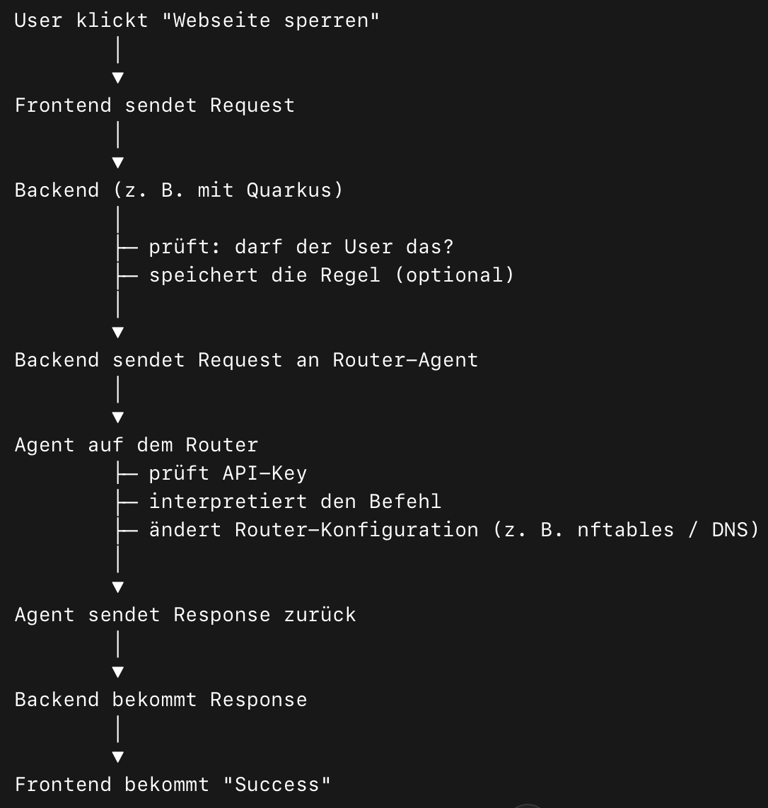

# Dokumentation: Kommunikation zwischen Backend und Router-Agent

Diese Dokumentation beschreibt die Architektur und den Datenfluss zur Steuerung von Router-Konfigurationen (z. B. Web-Sperren) über unser Quarkus-Backend.

---

## 1. Grober Ablauf (High-Level)

Der Prozess folgt einem klassischen **Client-Server-Agent-Modell**:

1.  **User-Interaktion:** User klickt im Frontend auf "Webseite sperren".
2.  **Request an Backend:** Das Frontend sendet die Anfrage an das Quarkus-Backend.
3.  **Logik & Validierung:** Das Backend prüft Berechtigungen und validiert die Daten.
4.  **Backend an Agent:** Das Backend sendet einen Request an den Router-Agenten.
5.  **Ausführung auf Router:** Der Agent prüft den API-Key und ändert die Router-Konfiguration (z. B. via `nftables`).
6.  **Response-Kette:** Der Status (Success/Error) wird bis zum Frontend zurückgereicht.

---

## 2. Die Komponenten im Detail

### A. Front-end
* **Aufgabe:** Erfasst den Nutzerwunsch (z. B. Sperrung einer Domain).
* **Aktion:** Sendet die Information per REST-Schnittstelle an das Backend.

### B. Back-end (Quarkus)
Das Backend fungiert als zentrale Kontrollinstanz:
* **Autorisierung:** Prüft, ob der User die nötigen Rechte für diese Änderung besitzt.
* **Validierung:** Stellt sicher, dass die Eingabe (z. B. URL oder IP) gültig und sicher ist.
* **Entscheidungslogik:** Bestimmt, welcher spezifische Befehl an welchen Router-Agenten gesendet werden muss.
* **Persistence:** Speichert die Regel optional in der Datenbank (für Status-Anzeigen).

### C. Router-Agent (Go-Binary)
Der Agent ist ein leichtgewichtiges Programm, das direkt auf dem Router installiert ist.

* **Form:** Eine **kompilierte Binary** (kein Script). Er läuft im Hintergrund als Service.
    * *Beispiel-Pfad:* `/usr/local/bin/router-agent`
* **Funktionsweise:**
    * Startet einen internen **Mini-HTTP-Server** (API).
    * Wartet auf authentifizierte Anfragen vom Backend.
    * Führt nach erfolgreicher Prüfung (API-Key) die echten Systembefehle aus.

---

## 3. Technische Entscheidungen

### Warum Go (Golang) für den Agenten?
Wir setzen auf Go, da es die perfekte Balance für Router-Hardware bietet:
* **Single Binary:** Erzeugt eine einzelne Datei, die alle Abhängigkeiten enthält.
* **No Runtime:** Läuft ohne Java, Python oder andere schwere Laufzeitumgebungen.
* **Performance:** Sehr effizient und ressourcensparend (wichtig für Router-CPUs).
* **Eingebauter HTTP-Server:** Sehr einfach, eine sichere API bereitzustellen.

*Alternativen wie Python (benötigt Runtime) oder C (zu komplex in der Entwicklung) wurden zugunsten der Wartbarkeit verworfen.*

---

## 4. Sicherheit & Best Practices

### Wichtige Sicherheitsregeln
> [!CAUTION]
> **Command Injection verhindern:** Niemals User-Inputs direkt in Shell-Commands einbetten! 
> *Schlecht:* `nft add rule ... + user_input`

* **Validierung:** Jede Domain und IP muss vor der Verarbeitung streng geprüft werden (nur erlaubte Zeichen).
* **API-Key:** Jede Kommunikation zwischen Backend und Agent muss durch einen API-Key im Header abgesichert sein.
* **Zugriffsbeschränkung:** Der Port des Agenten sollte idealerweise nur intern oder über gesicherte VPN-Verbindungen erreichbar sein.

### Performance & Stabilität
* **Fehlerhandling:** Der Agent muss prüfen: "Hat der Befehl wirklich funktioniert?" und entsprechende Logs schreiben.
* **Regel-Management:** Nicht unendlich viele Regeln erzeugen; alte oder doppelte Einträge müssen sauber bereinigt werden.

---

## 5. Berechtigungen & Sicherheit auf dem Router

Da der Router-Agent tiefgreifende Änderungen am System (Firewall, DNS) vornimmt, benötigt er spezielle Privilegien. Unter Linux gibt es dafür drei Ansätze:

### Sicherheitskonzept: "Least Privilege"
Um das Risiko bei einem potenziellen Hack des Agenten zu minimieren, sollte er nicht einfach als "Root" (Administrator für alles) laufen, sondern nur die exakt benötigten Rechte erhalten.

1.  **Root-User (Unsicher):** Der Agent hat volle Kontrolle über alles. Ein Bug im Code könnte das ganze System gefährden.
2.  **Sudo-Whitelist (Umständlich):** Der Agent muss jeden Befehl mit `sudo` aufrufen, was die Konfiguration komplexer macht.
3.  **Linux Capabilities (Best Practice):** Unsere gewählte Methode.

### Unsere Wahl: Linux Capabilities
Wir nutzen **Capabilities**, um dem Agenten exakt ein Recht zuzuweisen: `CAP_NET_ADMIN`. Dies folgt dem *Principle of Least Privilege*. Der Prozess kann das Netzwerk manipulieren, hat aber keinen Zugriff auf sensible Systemdateien oder andere User-Daten.

#### Implementierung auf dem Router
Nachdem die Go-Binary auf den Router kopiert wurde, wird ihr dieses Recht einmalig zugewiesen:

---

**Erstellt am:** 18. März 2026 von Manuel Freihaut

